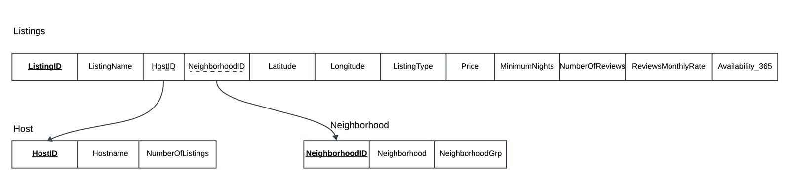

# New-York-City-Airbnb-Market-Analysis-and-Prediction
New York City Airbnb Market Analysis and Prediction
# Python Pro's is the name of the team
# Problem Statement

In the ever-changing landscape of the New York City Airbnb market, our project aims to analyze data and predict prices,
offering valuable insights for potential investors and discerning customers. Our main goal is to discover patterns that reveal
areas with the highest number of listings, understand the factors influencing different costs, and grasp the preferences of both
hosts and guests. By exploring the complex interactions between neighborhood characteristics, seasonal demand, and pricing
dynamics, our research aims to equip new investors with decision-making tools and provide customers with a strategic
advantage in selecting listings based on their preferences and budget constraints. This project provides a comprehensive
understanding for hosts and guests, offering a valuable resource for strategic decision-making in the dynamic and popular
Airbnb market.

# Project overview
In this Project, we used the Airbnb NYC dataset from Kaggle. The main objectives were to handle data precisely and adhere to project guidelines. We used Python to parse the raw data, organized it into a well-structured database, and harnessed SQL to merge it for analysis using Pandas. Once these steps were completed, we had the freedom to choose our next path. We  explored advanced data analysis with interactive elements and experimented with machine learning for predictions. Our project's success relied on executing each step meticulously, sharing our findings, and presenting a concise report. 

# Airbnb Price Prediction Project DataSet Overview

Column name	                      Description
listing_name	      The name of the Airbnb listing. (String)
host_name	          The name of the host of the Airbnb listing. (String)
neighbourhood_grp	  The neighbourhood group the Airbnb listing is located 
                    in. (String)
latitude	          The latitude coordinate of the Airbnb listing. (Float)
longitude	          The longitude coordinate of the Airbnb listing. (Float)
room_type	          The type of room offered by the Airbnb listing. 
                    (String)
price	              The price per night of the Airbnb listing. (Integer)
minimum_nights	    The minimum number of nights required for booking the 
                    Airbnb listing. (Integer)
number_of_reviews	  The total number of reviews the Airbnb listing has 
                    received. (Integer)
last_review	        The date of the last review the Airbnb listing has 
                    received. (Date)
reviews_per_month	  The average number of reviews the Airbnb listing 
                    receives per month. (Float)
calculated_host_listings_count	The total number of listings the host has. 
                    (Integer)
availability_365	  The number of days the Airbnb listing is available for 
                    booking in a year. (Integer)
NeighborhoodID      Neighborhood information for each listing (Referencing 
                    HostID from Host table)

| Column Name                       | Description                                            |
|-----------------------------------|--------------------------------------------------------|
| listing_name                      | The name of the Airbnb listing. (String)               |
| host_name                         | The name of the host of the Airbnb listing. (String)   |
| neighbourhood_grp                 | The neighbourhood group the Airbnb listing is located in. (String) |
| latitude                          | The latitude coordinate of the Airbnb listing. (Float) |
| longitude                         | The longitude coordinate of the Airbnb listing. (Float)|
| room_type                         | The type of room offered by the Airbnb listing. (String)|
| price                             | The price per night of the Airbnb listing. (Integer)   |
| minimum_nights                    | The minimum number of nights required for booking the Airbnb listing. (Integer) |
| number_of_reviews                 | The total number of reviews the Airbnb listing has received. (Integer)|
| last_review                       | The date of the last review the Airbnb listing has received. (Date)|
| reviews_per_month                 | The average number of reviews the Airbnb listing receives per month. (Float)|
| calculated_host_listings_count    | The total number of listings the host has. (Integer)   |
| availability_365                  | The number of days the Airbnb listing is available for booking in a year. (Integer)|
| NeighborhoodID                    | Neighborhood information for each listing (Referencing HostID from Host table)|

## Code & Resources Used
this Data set was obtained from Kaggle
dataset : https://www.kaggle.com/datasets/thedevastator/airbnbs-nyc-overview

## Data Cleaning
 we had created two parameters 'h' representing a header or list of column names and 'l_data' representing a list of lists containing data. Here indices are identified from the coloumns 'id', 'last_review', and 'name'. Few coloumns names are changed to be more readable and some unwanted columns are deleted, Moreover it deletes corresponding columns in the data rows to clean the dataset.Finally it streamlines the dataset by renaming columns and removing unnecessary data columns.
## Normalization
Normalised the rawdata into 3 tables, Host, Neighborhood, Listings.

Host table holds the data of hosts of all the listings.
Columns: HostID(PK), HostName, NumberOfListings

** HostID - Each host has an Unique ID 
** HostName - Host's Name
** NumberOfListings - Number of Listings under that host

Neighborhood table holds the data of airbnb listing locations.
Columns: NeighborhoodID(PK), NeighborhoodGroup, Neighborhood

** NeighborhoodID - Each Neighborhood has an Unique ID
** NeighborhoodGroup - Each Neighborhood's Area Location
** Neighborhood - Neighborhood's Name

Listing table holds the data of available airbnb listings in New York.
Columns: ListingID(PK), ListingName, HostID(FK), NeighborhoodID(FK), Latitude, Longitude, ListingType, Price, MinimumNights, NumberOfReviews, MonthlyReviewRate, Availability_365

** ListingID  - UniqueID for each Listing
** ListingName - Name of each listing
** HostID - Host information of each lisitng (Referencing HostID from Host table)
** NeighborhoodID - Neighborhood information for each listing (Referencing HostID from Host table)
** Latitude - Latitude information of the listing
** Longitude - Longitude information of the listing
** ListingType - Type of the listing(Entire Home/ Apartment or Single Room)
** Price - Price per night of the listing
** MinimumNights - The minimum number of nights required for booking the listing
** NumberOfReviews - The total number of reviews the listing has received
** MonthlyReviewRate - The average number of reviews the listing receives per month
** Availability_365 - The number of days the listing is available for booking in a year

## EDA

