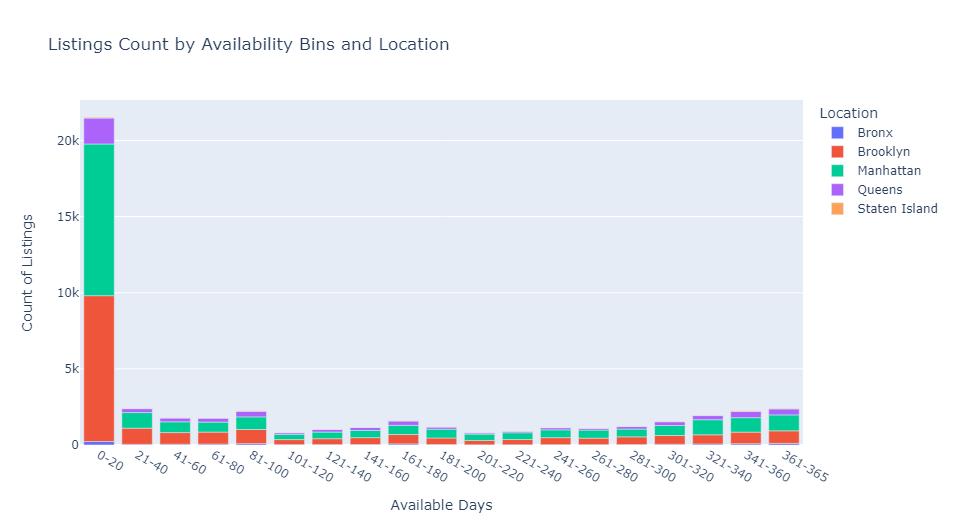

# New-York-City-Airbnb-Analysis: Project Overview 🚀
New York City Airbnb Market Analysis and Price Prediction
Analyzing the dynamic NYC Airbnb market: Predicting prices, exploring geographical trends, and understanding key factors. Utilized predictive modeling and interactive dashboards for comprehensive insights. Team project by [@Nihith Nath Kandikattu](https://github.com/nihith-nath), [@Keerthana Allam](https://github.com/Keerthana-Allam), [@Hithesh Kumar Duttuluri](https://github.com/hith777), and Charan Sai Pandaraboyina.

In this Project, we used the Airbnb NYC dataset from Kaggle. The main objectives were to handle data precisely and adhere to project guidelines. We used Python to parse the raw data, organized it into a well-structured database, and harnessed SQL to merge it for analysis using Pandas. Once these steps were completed, we had the freedom to choose our next path. We explored advanced data analysis with interactive elements and experimented with machine learning for predictions. Our project's success relied on executing each step meticulously, sharing our findings, and presenting a concise report.

Here is the outcome of the notebook in HTML: [AirBNB Listing Analysis](AirBNB_Listing_Analysis.html) - pls download the file 📥

# 🎯 Problem Statement

In the ever-changing landscape of the New York City Airbnb market, our project aims to analyze data and predict prices, offering valuable insights for potential investors and discerning customers. Our main goal is to discover patterns that reveal areas with the highest number of listings, understand the factors influencing different costs, and grasp the preferences of both hosts and guests. By exploring the complex interactions between neighborhood characteristics, seasonal demand, and pricing dynamics, our research aims to equip new investors with decision-making tools and provide customers with a strategic advantage in selecting listings based on their preferences and budget constraints. This project provides a comprehensive understanding for hosts and guests, offering a valuable resource for strategic decision-making in the dynamic and popular Airbnb market.

## 📚 Code & Resources Used

This dataset was obtained from Kaggle
- Dataset: [Airbnb NYC Overview](https://www.kaggle.com/datasets/thedevastator/airbnbs-nyc-overview)
- Data Source: The dataset was obtained from Kaggle. It comprises a dataset of size [48896*16] with columns including listing names, host details, location coordinates, pricing, and availability metrics.

## Airbnb Price Prediction Project DataSet Overview

## Metadata

| Column Name                       | Description                                            |
|-----------------------------------|--------------------------------------------------------|
| listing_name                      | The name of the Airbnb listing. (String)               |
| host_name                         | The name of the host of the Airbnb listing. (String)   |
| neighbourhood_grp                 | The neighbourhood group the Airbnb listing is located in. (String) |
| latitude                          | The latitude coordinate of the Airbnb listing. (Float) |
| longitude                         | The longitude coordinate of the Airbnb listing. (Float)|
| room_type                         | The type of room offered by the Airbnb listing. (String)|
| price                             | The price per night of the Airbnb listing. (Integer)   |
| minimum_nights                    | The minimum number of nights required for booking the Airbnb listing. (Integer) |
| number_of_reviews                 | The total number of reviews the Airbnb listing has received. (Integer)|
| last_review                       | The date of the last review the Airbnb listing has received. (Date)|
| reviews_per_month                 | The average number of reviews the Airbnb listing receives per month. (Float)|
| calculated_host_listings_count    | The total number of listings the host has. (Integer)   |
| availability_365                  | The number of days the Airbnb listing is available for booking in a year. (Integer)|
| NeighborhoodID                    | Neighborhood information for each listing (Referencing HostID from Host table)|

## Data Cleaning

- Parsed the TSV file to extract the header and listings data.
- Cleaned the data by renaming columns, removing unwanted columns, and handling missing values

## Normalization
we have Normalized the raw data into 3 tables, Host, Neighborhood, Listings to remove transitive dependencies improving Data Integrity and to prevent Insertion,Updation and Deletion Anamolies

### Host Table
| Column Name         | Description                                   |
|---------------------|-----------------------------------------------|
| HostID (PK)         | Unique ID for each host                       |
| HostName            | Host's Name                                   |
| NumberOfListings    | Number of Listings under that host            |

### Neighborhood Table
| Column Name         | Description                                   |
|---------------------|-----------------------------------------------|
| NeighborhoodID (PK) | Unique ID for each Neighborhood               |
| NeighborhoodGroup   | Each Neighborhood's Area Location             |
| Neighborhood        | Neighborhood's Name                           |

### Listing Table
| Column Name          | Description                                                |
|----------------------|------------------------------------------------------------|
| ListingID (PK)       | Unique ID for each Listing                                  |
| ListingName          | Name of each listing                                        |
| HostID (FK)          | Host information of each listing (Referencing HostID from Host table) |
| NeighborhoodID (FK)  | Neighborhood information for each listing (Referencing HostID from Host table) |
| Latitude             | Latitude information of the listing                        |
| Longitude            | Longitude information of the listing                       |
| ListingType          | Type of the listing (Entire Home/Apartment or Single Room) |
| Price                | Price per night of the listing                              |
| MinimumNights        | The minimum number of nights required for booking the listing |
| NumberOfReviews      | The total number of reviews the listing has received        |
| MonthlyReviewRate    | The average number of reviews the listing receives per month|
| Availability_365     | The number of days the listing is available for booking in a year |

## EDA
## Exploratory Data Analysis (EDA)

During the Exploratory Data Analysis (EDA) phase, we visualized various aspects of the Airbnb dataset to gain insights into the distribution of listings, availability, and location. The following graphs provide a comprehensive analysis of the data:

1. **Donut Chart: Percentage Distribution of Listings Across Neighborhood Groups**
   - Manhattan & Brooklyn collectively dominate the market, with Manhattan (44.3%) and Brooklyn (41.1%) resulting in a combined share of over 80%.

   

2. **Stacked Column Chart: Distribution of Listing Counts Based on Availability Bins and Location**
   - Approximately 40% of listings fall within the 0-20 days availability bin.
   - Most properties have limited availability, indicating a strong presence of short-term rental options.

   

3. **Horizontal Bar Chart**:
    - Illustrates the distribution of listings by listing type, with the majority being of the "Entire home/apt" type, comprising approximately 52% of the total listings in the dataset.
  
    

4. **Scatter Plot**:
    - Depicts the relationship between room type, price, and neighborhood group in the dataset, highlighting the distribution of prices across different room types and neighborhood groups.

    

5. **Scatter Map Plot**:
    - Illustrates the geographical distribution of listings in NYC based on latitude and longitude, with color-coded markers representing different room types.
      
   

6. **Bar Chart**:
     - Depicts the average listing prices in different neighborhood groups in NYC, highlighting variations in prices across neighborhoods. Manhattan has the highest average listing price of around 197$.

     
7.  **Scatter Plot / Density Heat Map**:
     - It illustrates the concentration and pricing variations of listings across different neighborhoods in New York City. The blue dots highlight locations of key attractions, offering a spatial overview within the diverse NYC landscape.

        
## Combining Data and Correlation Analysis:
   - Combined data from normalized database tables.
   - Analyzed the correlation matrix to identify relationships between variables.
   - Strong Negative Co-relation of Listing Type and Longitude Predictors with Price has been observed
     

# 🌆 Conclusion

In conclusion, our project conducted an in-depth analysis of the dynamic New York City Airbnb market, revealing significant insights. We meticulously explored room availability, categorized neighborhoods, and pinpointed locations near key tourist attractions, leading to the following key findings and insights.

## 🔍 Key Findings:

### Geographical Trends:
- Manhattan and Brooklyn are the most dominant areas in terms of both listing count and prices.
- Airbnb listings are densely concentrated around popular tourist spots, including Times Square, the Empire State Building, and Central Park.

### Listing Type:
- Entire apartments are the most popular listing type in New York City.

### Availability Analysis:
- Most Airbnb listings exhibit limited availability throughout the year.
- The scarcity of short-term rentals in NYC contributes to elevated prices.

### Correlation Analysis:
- The correlation matrix suggests that the prices of Airbnb listings in NYC are majorly influenced by the listing type and longitude, suggesting there is a notable relationship between the type of listing (such as entire home/apartment or private room) and the geographical location (longitude) with the pricing of the listings.

These insights provide a comprehensive understanding of the New York City Airbnb market, enabling better decision-making for both hosts and guests in the dynamic and competitive environment. 🏙️🏡📊
